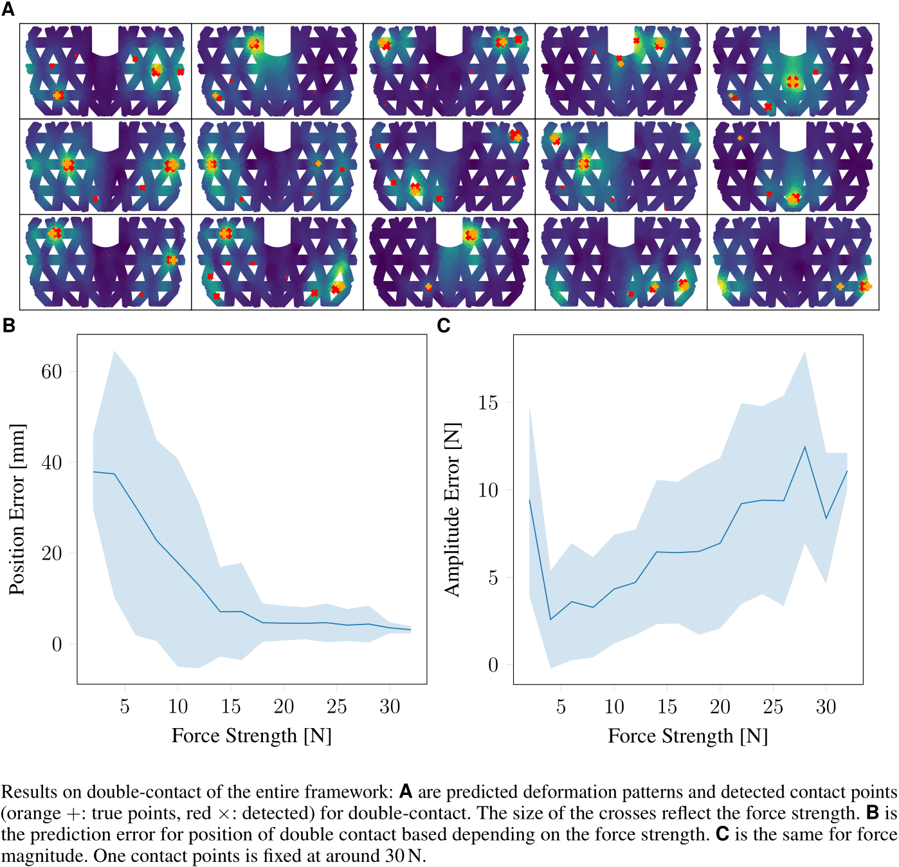

# Haptics-with-Strain-Gauge
This project shows the principle design of [virtual sensing](https://en.wikipedia.org/wiki/Virtual_sensing) in robotic system with haptic feedback using **sparse sensor configuration**.

<p align="center">

It includes five major parts:
- Robot's limb design, manufacturing in mechanical aspect.
- Sensor choice, positioning, assembly, data acquision in mechatronic aspect.
- Automatic data collection system in application aspect.
- Data postprocessing in functionality aspect.
- System integration in robotic application aspect.

## Research agent
We adopt one open-source project ["Poppy Project-Humanoids"](https://www.poppy-project.org/en/) and make contributions to optimize the hardware, software, and web tools.

In this repository, we introduce haptic feedback in robot's limb, which realizes single-contact and **multi-contact** stimulation localization and quantifization functions.

<p align="center">

## Robot's limb design, manufacturing in mechanical aspect
### Limb design in [Solidworks](https://www.solidworks.com/de)
- Keep kinematic parameters unchanged
- In Solidworks, [parametrize](http://help.solidworks.com/2017/english/solidworks/cworks/parameters_2.htm) thickness of the flexible sensing shell and the in-middle placed structure support. ([Model](Hardware/Solidworks))

<p align="center">

### Limb design validation in [ANSYS: Workbench-Static Structure](https://www.ansys.com/products/structures)
- Robustness check: whether the strucutre can support the  whole weight of the robot during its dynamics motion?([Model](Hardware/ANSYS/01_Weight_Test))
- Flexiablity check: how flexible the outer-shell of the limb is agagist stimulation?([Model](Hardware/ANSYS/02_Skin_Test))
- Material:[PA2200](https://www.shapeways.com/rrstatic/material_docs/mds-strongflex.pdf)

<p align="center">

### 3D printing
- Supplier: [Shapeways](https://www.shapeways.com/)
- Printing material: [White Versatile Plastic](https://www.shapeways.com/materials/versatile-plastic)
  - [Datasheet](https://www.shapeways.com/rrstatic/material_docs/mds-strongflex.pdf)
- Printing approach: [Selective Laser Sintering](https://en.wikipedia.org/wiki/Selective_laser_sintering)

<p align="center">
  
## Sensor choice, positioning, assembly, data acquision in mechantronic aspect
- Sensor choice: [Strain Gauge:EP-08-250BF-350](http://docs.micro-measurements.com/?id=2573) with high elongation ratio 20% for plastic application.
- Sensor supplier: [Micro Measurement](http://docs.micro-measurements.com)
- Sensor positioning: four methods are compared in [Sun & Martius](https://ieeexplore.ieee.org/abstract/document/8625064)
  - Collection of simulation data:[Tutorial](Code/ANSYS_Data_Collection.md)
  - Data-driven and Model-based methods are compared in [Sun & Martius](https://ieeexplore.ieee.org/abstract/document/8625064): [Tutorial](Code/Optimal_positioning.md)
  
  <p align="center">

- Sensor assembly:[Tutorial](Hardware/Assembly/Assembly.md)
  - Adhesive:[M-BOND AE10](https://www.micro-measurements.com/pca/detail/5c49d0afeaf7657493741ba9)
  - Pretightedn structure:

 <p align="center">

- Data aquisition: [Wheastone bridge](https://en.wikipedia.org/wiki/Wheatstone_bridge):**Tutorial follows**
  - Layout Type: Quarter bridge (1. use global temperatur compensation, 2. other solutions [BME280](https://www.bosch-sensortec.com/bst/products/all_products/bme280) due to physical limits)
  - Operational Amplifier: [MCP609](http://ww1.microchip.com/downloads/en/DeviceDoc/11177f.pdf)
  - ADC and MCU: [Arduino Due 3.3V](https://store.arduino.cc/due)
    - ino:
    ``` sketch
    int val1 = 0;
    int val2 = 0;
    int val3 = 0;
    int val4 = 0;
    int val5 = 0;
    int val6 = 0;
    int val7 = 0;
    int val8 = 0;
    int val9 = 0;
    int val10 =0;
    void setup()
    {
      Serial.begin(115200);              //  setup serial
    }

    void loop()
    {
      analogReadResolution(12);
      val1 = analogRead(0);
      val2 = analogRead(1);
      val3 = analogRead(2);
      val4 = analogRead(3);
      val5 = analogRead(5);
      val6 = analogRead(6);
      val7 = analogRead(7);
      val8 = analogRead(8);
      val9 = analogRead(9);
      val10 = analogRead(10);
      Serial.print(val1);
      Serial.print(",");
      Serial.print(val2);
      Serial.print(",");
      Serial.print(val3);
      Serial.print(",");
      Serial.print(val4);
      Serial.print(",");
      Serial.print(val5);
      Serial.print(",");
      Serial.print(val6);
      Serial.print(",");
      Serial.print(val7);
      Serial.print(",");
      Serial.print(val8);
      Serial.print(",");
      Serial.print(val9);
      Serial.print(",");
      Serial.println(val10);

      delay(100);
    }
    ```
  - Communication: USB2.0 to hoster.
  
## Automatic data collection system in application aspect **Tutorial follows**
- 4 DoF test bed to collect data:
  - 3 DoF 3D printer: [Flashforge Creator Pro](http://www.flashforge.com/creator-pro-3d-printer/)
  - 1 Dof Dynamixel [MX28AT](http://support.robotis.com/en/product/actuator/dynamixel/mx_series/mx-28at_ar.htm)
  
<p align="center"> 
  
- Driver:
  - 3D printer: makerbot_driver
  - Dynamixel: pypot.dynamixel
- Forcetip: [FC22](https://www.te.com/commerce/DocumentDelivery/DDEController?Action=srchrtrv&DocNm=FC22&DocType=DS&DocLang=English)
- Code in python (jupyter notebook)
  ``` jupyter notebook
   cd /mnt/StorageDevice/PhD/06_Paper/v\?_Frontiers\ in\ NR2018/ICRA2019/SingleTouch/Experiemental_Data
  ```
## Data postprocessing in functionality aspect.
- single-contact detection: KNN, SVR, FNN (direct position and magnitude prediction),see [Sun & Martius](https://ieeexplore.ieee.org/abstract/document/8625064)

<p align="center"> 
  
- multiple-contact detection: FNN (Tranfer Net,Reconstruction Net, Sensitivity Net integration to extract multiple-contact information), see [Sun & Martius]()

<p align="center"> 
