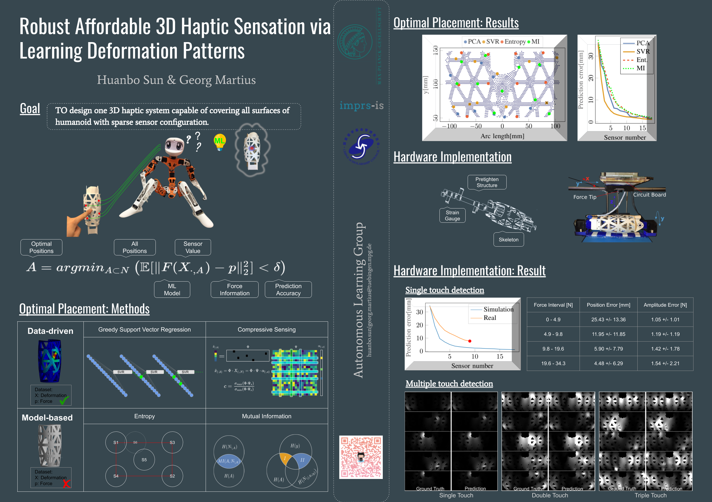
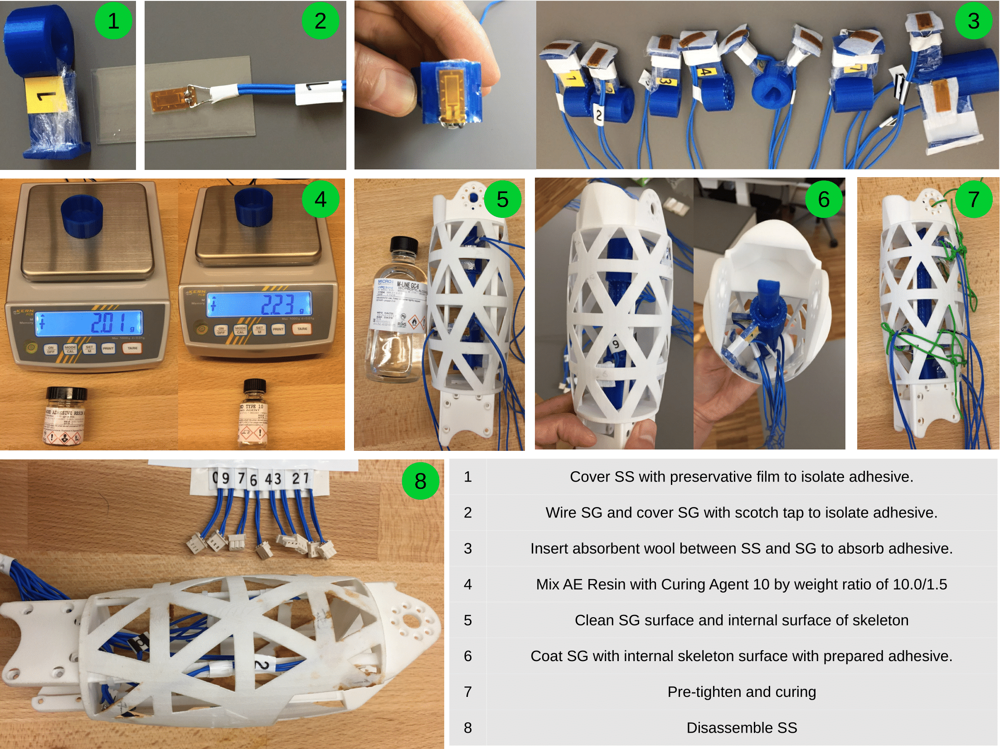
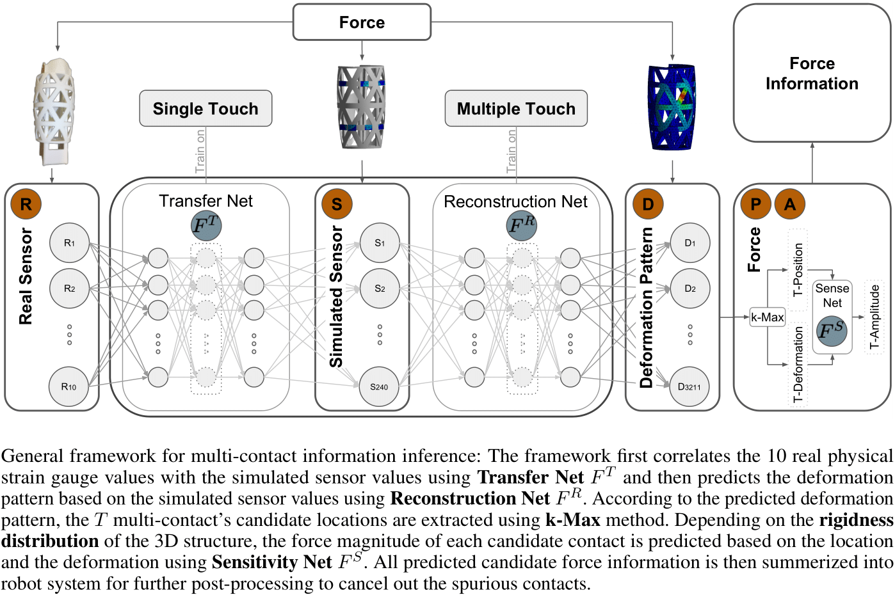

# Haptics for Robots: HapDef
<p align="right">
  *This is the only official content release regarding the design of HapDef.*
</p>

This project shows the principle design of [virtual sensing](https://en.wikipedia.org/wiki/Virtual_sensing) in robotic system with haptic feedback using **sparse sensor configuration**.

<p align="center">

The paper 1 is titled "[Robust Affordable 3D Haptic Sensation via Learning Deformation Patterns](https://ieeexplore.ieee.org/document/8625064)", published at [*IEEE-RAS Humanoids*, 2018](https://ieeexplore.ieee.org/document/8625064). 

The paper 2 is titled "[Machine Learning for Haptics: Inferring Multi-Contact Stimulation From Sparse Sensor Configuration](https://www.frontiersin.org/articles/10.3389/fnbot.2019.00051/full)", published at [*Frontiers in Neurorobotics*, 2019](https://www.frontiersin.org/articles/10.3389/fnbot.2019.00051/full)
  
This work was done by Huanbo Sun, Georg Martius at the Max Planck Institute for Intelligent Systems.
  
If you make used of our work, please use the citation information [below](#Citation).
 
# Content
 It includes five major parts:
- Robot's limb design, manufacturing in mechanical aspect.
- Sensor choice, positioning, assembly, data acquision in mechatronic aspect.
- Automatic data collection system in application aspect.
- Data postprocessing in functionality aspect.
- System integration in robotic application aspect.

## Research agent
We adopt one open-source project ["Poppy Project-Humanoids"](https://www.poppy-project.org/en/) and make contributions to optimize the hardware, software, and web tools.

In this repository, we introduce haptic feedback in robot's limb, which realizes single-contact and **multi-contact** stimulation localization and quantifization functions.

<p align="center">

## Robot's limb design, manufacturing in mechanical aspect
### Limb design in [Solidworks](https://www.solidworks.com/de)
- Keep kinematic parameters unchanged
- In Solidworks, [parametrize](http://help.solidworks.com/2017/english/solidworks/cworks/parameters_2.htm) thickness of the flexible sensing shell and the in-middle placed structure support. ([Model](Hardware/Solidworks))

<p align="center">

### Limb design validation in [ANSYS: Workbench-Static Structure](https://www.ansys.com/products/structures)
- Robustness check: whether the strucutre can support the  whole weight of the robot during its dynamics motion?([Model](Hardware/ANSYS/01_Weight_Test))
- Flexiablity check: how flexible the outer-shell of the limb is agagist stimulation?([Model](Hardware/ANSYS/02_Skin_Test))
- Material:[PA2200](https://www.shapeways.com/rrstatic/material_docs/mds-strongflex.pdf)

<p align="center">

### 3D printing
- Supplier: [Shapeways](https://www.shapeways.com/)
- Printing material: [White Versatile Plastic](https://www.shapeways.com/materials/versatile-plastic)
  - [Datasheet](https://www.shapeways.com/rrstatic/material_docs/mds-strongflex.pdf)
- Printing approach: [Selective Laser Sintering](https://en.wikipedia.org/wiki/Selective_laser_sintering)

<p align="center">
  
## Sensor choice, positioning, assembly, data acquision in mechantronic aspect
- Sensor choice: [Strain Gauge:EP-08-250BF-350](http://docs.micro-measurements.com/?id=2573) with high elongation ratio 20% for plastic application.
- Sensor supplier: [Micro Measurement](http://docs.micro-measurements.com)
- Sensor positioning: four methods are compared in [Sun* & Martius](https://ieeexplore.ieee.org/abstract/document/8625064)
  - Collection of simulation data:[Tutorial](Code/ANSYS_Data_Collection.md)
  - Data-driven and Model-based methods are compared in [Sun* & Martius](https://ieeexplore.ieee.org/abstract/document/8625064): [Tutorial](Code/Optimal_positioning.md)
  
  <p align="center">

- Sensor assembly:
  - Adhesive:[M-BOND AE10](https://www.micro-measurements.com/pca/detail/5c49d0afeaf7657493741ba9)
  - Pretighten Structure(SS):
  <p align="center"> 
  
  - Assembly Process:

 <p align="center">

- Data aquisition: [Wheastone bridge](https://en.wikipedia.org/wiki/Wheatstone_bridge):
  - Layout Type: Quarter bridge (Regarding to temperatur compensation: 1.Use a global one(not suit for long-last contact detection with heat transferring effect), 2. Use [BME280](https://www.bosch-sensortec.com/bst/products/all_products/bme280) can sense temperature and humidity as well as pressure locally, which is another new project under construction.)
  - Operational Amplifier: [MCP609](http://ww1.microchip.com/downloads/en/DeviceDoc/11177f.pdf)
  - Board Design Concept and Breadboard: [Breadboard Concept](Files/Breadboard_Concept.pdf) 
  
   <p align="center">
  
  - ADC and MCU: [Arduino Due 3.3V](https://store.arduino.cc/due)
    - Code for ino: [Tutorial](Code/MCU_Data_Acquisition.md)
  - Communication: USB2.0(micro) to Master(Laptop).
  
## Automatic data collection system in application aspect
- 4 DoF test bed to collect data:
  - 3 DoF 3D printer: [Flashforge Creator Pro](https://www.flashforge.com/product-detail/4)
  - 1 Dof Dynamixel [MX28AT](http://support.robotis.com/en/product/actuator/dynamixel/mx_series/mx-28at_ar.htm)
  
<p align="center"> 
  
- Driver:
  - 3D printer: [makerbot_driver](https://pypi.org/project/makerbot_driver/)
  - Dynamixel: [pypot.dynamixel](https://poppy-project.github.io/pypot/dynamixel.html)

- Forcetip: [FC22](https://www.te.com/commerce/DocumentDelivery/DDEController?Action=srchrtrv&DocNm=FC22&DocType=DS&DocLang=English)

- Data Collection in Real System Interfacing with Python:
  - [Tutorial](Code/Data_Collection_in_Real_System.md)
  - [Video](https://www.youtube.com/watch?v=enS9tn03XHs&feature=youtu.be)
    - Video Editor: [Kdenlive](https://kdenlive.org/en/)

## Data postprocessing in functionality aspect **UNDER CONSTRUCTION**
- Single-contact detection: KNN, SVR, FNN (direct position and magnitude prediction).
  - Documentation, see [Sun* & Martius 1](https://ieeexplore.ieee.org/abstract/document/8625064) & [Sun* & Martius 2]()
  - Model training and calling, see [Single_contact_Model](Code/Single_contact_Model.md)
  - Results
    - [Video 1: Automatically](https://www.youtube.com/watch?v=OUCoWmoomNc)
    - [Video 2: Manually](https://www.youtube.com/watch?v=OvVJsDUFhkk)
    - Image:

<p align="center"> 
  
- Multiple-contact detection: FNN (Tranfer Net,Reconstruction Net, Sensitivity Net integration to extract multiple-contact information)
  - Concept:
  <p align="center"> 
  
  - Documentation, see [Sun* & Martius 2](https://www.frontiersin.org/articles/10.3389/fnbot.2019.00051/full)
  - Model integration, see [Multiple_contact_Model](Code/Multiple_contact_Model.md)
  - Results:
    - Image:
<p align="center"> 

## Future Work
### Hardware site
#### Temperature compensation
- Problem: Currently, we use half-bridge Wheastone bridge layout to compensate the temperature effect. But the temperature strain gauges are not placed closely to the deformation strain gauges, which only compensate the global temperature effect. For example, the precision would be influenced quite a lot when we put finger on the skeleton for a long time.
- Solution: Take tiny temperature sensor and place them near each deformation strain gauges.

#### Drift effect(Hysteresis effect)
- Problem: The material has a mechanical non elastic property, which prevent the structure recovering its shape after releasing force. 
- Solution: Collect data and train extra model to compensate this effect.

#### Hardware optimization
- Problem: Circuit layout is currently hand wired and bulky,using potentialmeter to initialize the non-deformation state.
- Solution: 
  - PCB [Eagle](https://www.autodesk.com/products/eagle/overview) design and printing.
  - Using [Digital Potentialmeter](https://www.mouser.de/Semiconductors/Digital-Potentiometer-ICs/_/N-4c498/) replacing mechanical potentialmeter.
  
#### Hardware integration
- Problem: For each robot skeleton, it needs to process individually its functionality. For robotic haptic integration, we need to define a communication protocol/interface.
- Solution: Daisy chain protocol integration.
  
 ### Algorithm site
 #### Non positive semi definite kernel
 - Problem: the covariance matrix (kernel) used in Mutual Information and Entropy for optimal placement sometime apears to be non positive semi defnitite, especially for [Riemanian-manifold](https://en.wikipedia.org/wiki/Riemannian_manifold). 
 - Solution: unknown.
 
 #### Network structure optimization
 - Problem: the network trained now is quite large,which could be compacted theoretically.
 - Solution: literature survey.
 
 ### Metric to evaluate the precision for multiple contact (OPEN QUESTION to Haptic Community)
 - Problem: We are still not very clear, which information is really needed for robotic application:
  - Displacement?
  - Specify position, directional force amplitude?
  - Torsion?
  - Multiple contact?
  - Surface contact?
 
 # Citation
 ## Paper 1
 ``` Paper 1
 @conference{SunMartius2018:SingleTouchSensation,
  title = {Robust Affordable 3D Haptic Sensation via Learning Deformation Patterns},
  author = {Sun, Huanbo and Martius, Georg},
  booktitle = {Proceedings International Conference on Humanoid Robots},
  pages = {846-853},
  publisher = {IEEE},
  address = {New York, NY, USA},
  year = {2018},
  note = {Oral Presentation},
  doi = {10.1109/HUMANOIDS.2018.8625064}
}
 ```
## Paper 2
 ``` Paper 2
@article{SunMartius2019:MultiContact,
  title = {Machine Learning for Haptics: Inferring Multi-Contact Stimulation From Sparse Sensor Configuration},
  author = {Sun, Huanbo and Martius, Georg},
  journal = {Frontiers in Neurorobotics},
  volume = {13},
  pages = {51},
  year = {2019},
  doi = {10.3389/fnbot.2019.00051},
  url = {https://www.frontiersin.org/article/10.3389/fnbot.2019.00051}
}
 ```
